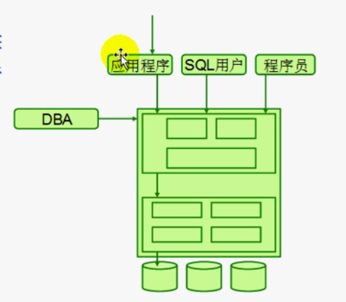

# 关系型数据库基础理论

### 1、文件管理
- 文件管理所存在的问题
    * 数据冗余和不一致性(不一致：同一个数据若需存储多份)
    * 数据访问困难(若需比较大文件的不同，将数据导入内存访问困难)
    * 数据孤立
    * 完整性问题
    * 原子性问题
    * 并发访问异常(同一个文件如何让多个用户同时修改访问)
    * 安全性问题(某个用户如何只看到它想看的数据)
```   
文件：
    表示层(展现出来的样子)
        文件
    逻辑层(表示层和物理层之间建立对应关系并完成映射)：
        文件系统：将表示层文件解构为物理层数据<存储引擎>
    物理层(磁盘上的样子)：
        元数据
        数据：数据块

关系型数据：
    表示层：库、表、视图、索引...
    逻辑层：存储引擎
    物理层：数据文件(文件的表示层)
```

### 2、数据库管理系统: DBMS
* 数据库管理系统: DBMS
    * 层次模型
    * 网状模型
    * 关系模型(结构化数据模型) ：结构化即每行数据表示的结构都相同

```
关系：关系代数运算(可以按照某种关系进行代数运算的模型)
    交集/并集/差集/全集/补集

SQL：Structure Query Language(结构化查询语言)
    DML:数据操作语言
        insert/delete/select/update
    DDL:数据定义语言：定义数据库对象
        create/drop/alter
        实现数据的存储和定义
        关系型数据库对象: RDB对象
            库、表、索引、视图、用户、存储过程、存储函数、触发器、事件调度器...
            约束constraint：数据库可以自己检查有无逻辑性错误(有效数据范围)
                域约束：数据类型约束
                外键约束：引用完整性约束(一张表引用了另外一张表数据的合法性：一个表中字段所填的值必须保证另外一张表关联字段存在这个值)
                主键约束：某一个字段或某些字段可以唯一标识此字段所属的实体，并不允许为空，一个表只能有一个主键
                唯一性约束：每一行的某字段都不允许出现相同值，但可以为空，可以有多个唯一键
                检查性约束：保证不会出现违反常理的数据，例如：域约束可以保证age为int型，但检查性约束可以保证age数据均大于0且小于200
    DCL:数据控制语言
        访问权限：grant/revoke
```

#### 关系模型
* E-R实体关系模型：靠一张二维表保存数据，将这张表可以拆分为多个实体，通过某些一些关系产生外在联系
* 对象关系模型(基于对象的数据模型)：存储一些非常大的数据：将大数据存储在数据库文件系统或数据库管理系统的某一个存储空间上，在表中用指针指向这个数据
* 半结构化数据模型(每行数据表示的意义/结构或许不同)XML 扩展标记语言：数据及数据结构（数据标签)都存储下来

### 3、关系型数据库管理系统：RDBMS



* 存储组件：存储管理器
    * 存储管理器应该具备的功能
        * 权限及完整性管理器
        * 事务管理器
        * 文件管理器
        * 缓冲区管理器：管理缓冲空间
* 查询管理器：接收、理解用户查询请求，并提交给存储组建
    * 查询管理器应该具备的功能
        * DML解释器
        * DDL解释器
        * DCL解释器
        * 查询执行引擎：最终完成数据的增删查改或者结构的创建修改等

**MySQL单进程多线程：**
- 单进程
- 多线程
    * 守护线程：完成将数据从缓冲区写到磁盘上，定期将数据从内存写到磁盘上
    * 应用线程：用户退出则线程退出
        * 多个用户同时访问大数据导致变慢：缓存
        * 线程重用

```
在计算机体系结构中，每个进程所能使用的地址空间有限
eg:在x86_32位系统中，一共4G地址空间，内核占用1G，有效内存仅有2.7G
    64位系统，取决于数据库配置

smp：对称多处理器
mysql一个查询只能在一个cpu上执行，可以拆分在多个服务器上执行，最终拼接，提高性能
```

**关系运算(实现SQL语句的执行)：**
* 投影：只输出指定字段
* 选择：只输出符合条件的行
* 自然连接：具有相同名字属性上所有取值相同的行
* 笛卡尔积｜交叉连接：多项式乘积
* union：并集
